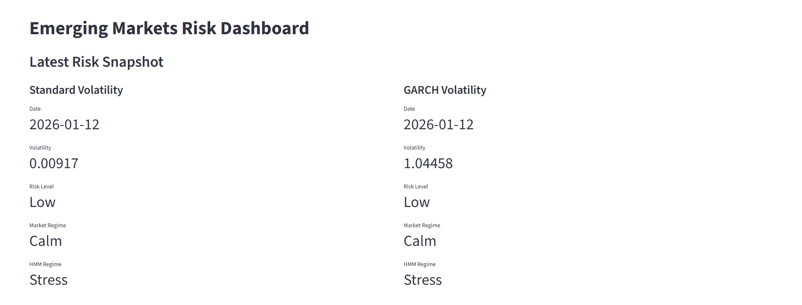
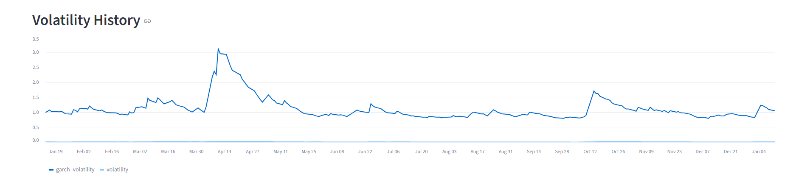
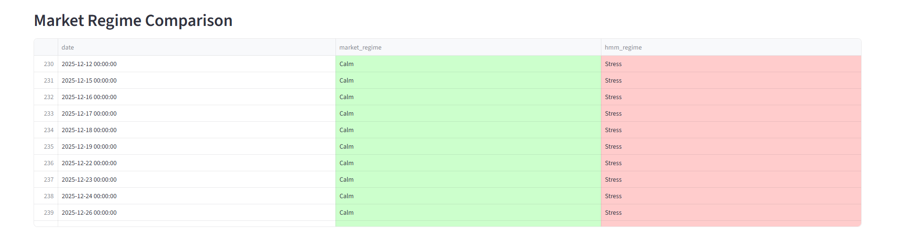
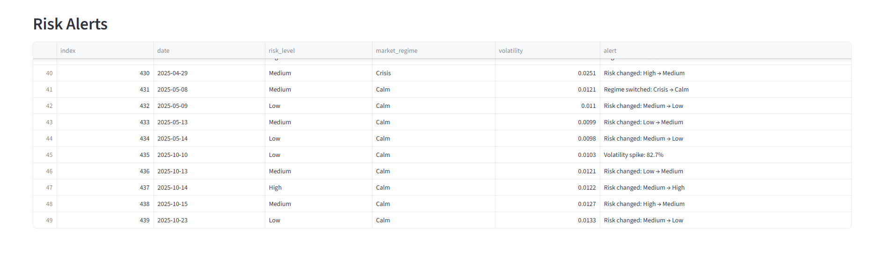

# Emerging Markets Volatility & Risk Signal System

## Overview

This is a volatility and risk monitoring system for emerging markets. It helps investment teams, fintech platforms, and risk managers see when markets are stressed and decide how much to invest or reduce exposure.

The system does not predict prices. It focuses on risk levels and market regimes, showing when markets move from calm to stressed conditions.

It has three main parts:

1. **Data pipeline:** loads data and calculates volatility.
2. **REST API:** provides risk signals to dashboards or other apps.
3. **Streamlit dashboard:** shows risk signals, history, and alerts visually.

## Problem This Solves

Market drops are often preceded by rising volatility.

Many teams:

* React too late
* Make subjective decisions
* Have no standard risk signal

This system gives:

* A quantitative volatility signal
* Risk levels (Low, Medium, High)
* Market regime labels (Calm, Stress)
* Programmatic access through API endpoints


## Who Uses This & Why

* Portfolio managers monitoring EM exposure
* Fintech platforms offering investment products
* Risk teams setting limits and alerts

It supports daily exposure and risk decisions, such as:

* **Keep exposure the same:** when the market is calm
* **Reduce positions:** when risk rises
* **Tighten risk limits:** reduce leverage or be cautious
* **Send alerts:** when risk levels or regimes change

### How to Read the Signals

| Risk Level | Market Regime | Action                       |
| ---------- | ------------- | ---------------------------- |
| Low        | Calm          | Stay invested or increase    |
| Medium     | Transition    | Reduce leverage, be cautious |
| High       | Stress        | Reduce exposure, send alerts |


## Example Output

```json
{
  "date": "2026-01-12",
  "volatility": 0.0091,
  "garch_volatility": 1.0445,
  "risk_level": "Low",
  "market_regime": "Calm",
  "hmm_regime": "Stress"
}
```
**Meaning:** Volatility is low, so the market looks calm. However, the HMM model detects hidden stress in the background. This shows how the system compares simple rules with a machine learning model.

## System Architecture

**Data → Pipeline → Risk Signals → API → Dashboard**

1. Pull historical prices from Yahoo Finance.
2. Compute daily returns.
3. Compute rolling volatility (baseline).
4. Compute GARCH volatility (reacts faster to shocks).
5. Assign risk levels using volatility percentiles.
6. Label market regimes:
   * Rule-based: Calm or Stress
   * HMM: detects hidden stress
7. Generate alerts for:
   * Risk level changes
   * Volatility spikes vs previous day
   * Regime transitions
8. Provide results using FastAPI endpoints.
9. Display everything in a Streamlit dashboard.


## Key Features

* **Latest Risk Snapshot:** standard and GARCH volatility
* **Volatility History Chart:** trends over time
* **Market Regime Comparison:** rule-based vs HMM (green/red colouring)
* **Smart Alerts Feed:** risk changes, volatility spikes, regime shifts
* **REST API:** `/risk/latest`, `/risk/latest-garch`, `/risk/history`, `/alerts`

## Project Structure

```
project-root/
├── src/
│   ├── api.py       
│   ├── data_loader.py
│   ├── features.py
│   ├── risk_engine.py
│   ├── regime.py
│   ├── hmm_regime.py
│   ├── signals.py      
│   ├── outputs.py      
│   ├── pipeline.py
│   └── config.py
│
├── notebooks/
│   └── data_exploration.ipynb
│
├── app.py              
├── scripts/
│   └── sanity_check.py
├── README.md
├── requirements.txt
└── .gitignore
```

## API Endpoints

* `/risk/latest` - latest standard volatility risk signal
* `/risk/latest-garch` - latest GARCH volatility signal
* `/risk/history` - last 250 days of volatility, risk levels, regimes
* `/alerts` - points where risk levels or regimes changed
* `/health` - simple health check


## Smart Alerts

Alerts are generated when:

* **Risk level changes** (Low → Medium → High)
* **Volatility spikes** (compared to yesterday)
* **Market regime changes** (Calm to Stress/Crisis)

**Example alert feed:**

| Date       | Volatility | Risk Level | Market Regime | Alert                      |
| ---------- | ---------- | ---------- | ------------- | -------------------------- |
| 2022-09-26 | 0.0117     | Medium     | Calm          | Risk changed: Low → Medium |
| 2022-09-29 | 0.0125     | Low        | Calm          | Risk changed: Medium → Low |


## Limitations & Future Improvements

* Uses end-of-day data only (no intraday signals)
* Risk thresholds are percentile-based, not fully learned
* Current regime logic is mostly rule-based

Future improvements could include:

* HMM or Bayesian regime switching
* Multi-asset or cross-market risk aggregation
* Real-time cloud deployment
* More use of GARCH volatility in regime detection


## How to Run

1. Clone repo:

```bash
git clone <repo-url>
cd volatility-risk-system
```

2. Create and activate virtual environment:

```bash
python -m venv venv
# Windows
venv\Scripts\activate
# macOS / Linux
source venv/bin/activate
```

3. Install dependencies:

```bash
pip install -r requirements.txt
```

4. Start FastAPI server:

```bash
uvicorn src.api:app --reload
```

5. Start Streamlit dashboard:

```bash
streamlit run app.py
```

## Screenshots

### Dashboard Overview


### Volatility History


### Market Regime Comparison


### Risk Alerts


## Disclaimer

This project is for learning and portfolio purposes only. It is not financial advice.