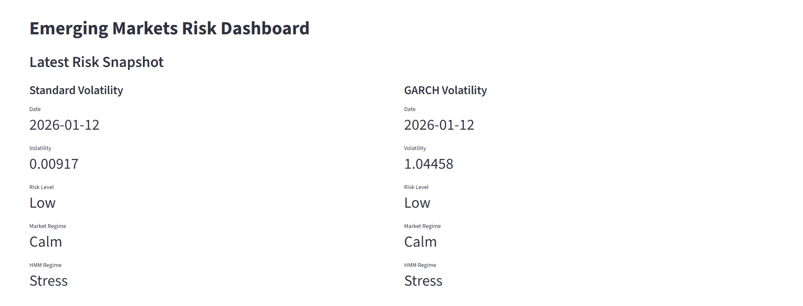
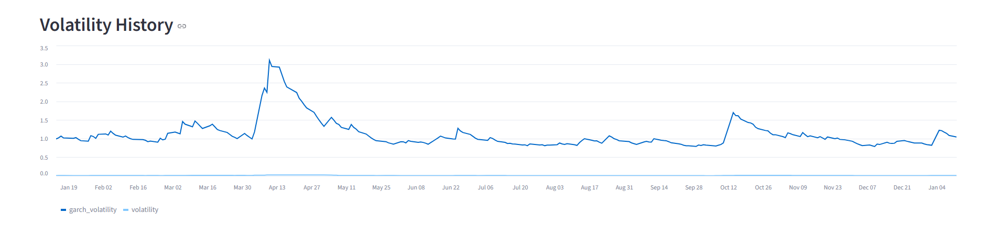
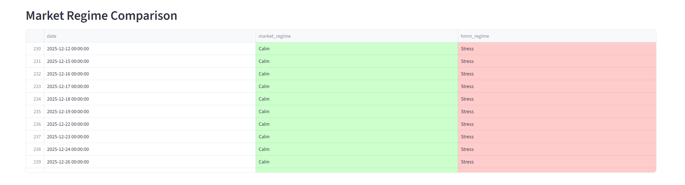
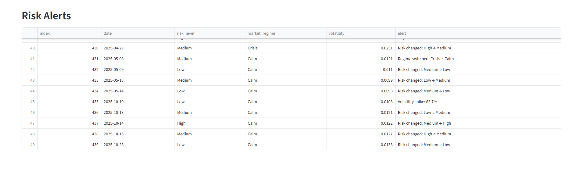

# Volatility Risk System

A tool that watches how jumpy a market is and says whether it looks calm or stressed.

It does not predict prices. It tells you what the current conditions look like.

> **Note on scope:** this is a personal project built to learn volatility modelling. It uses free end of day data from Yahoo Finance. It is not financial advice and it has not been tested against real trading outcomes.

---

## The question

Big market drops usually come after volatility starts rising.

So the question is simple:

> **Can you tell, from price movements alone, when a market has shifted from calm to stressed?**

---

## What it tracks

Daily closing prices from Yahoo Finance. You pick the asset in the sidebar:

| Ticker | What it is |
|---|---|
| **EEM** | iShares MSCI Emerging Markets ETF. This is the default, and the reason the project is framed around emerging markets. |
| **SPY** | S&P 500 ETF, included as a developed market comparison. |
| **BTC-USD** | Bitcoin, included because it is far more volatile than either, which makes the risk levels easy to see working. |

Prices are pulled live each time the app loads, so the dashboard is always current.

---

## How it works

**1. Get the data.** Daily prices from Yahoo Finance, turned into daily returns.

**2. Measure how jumpy it is, two ways.**

- A rolling standard deviation. Simple, but slow to react.
- A GARCH model. Reacts faster when something happens, because it treats today's volatility as partly carried over from yesterday.

**3. Turn that into a risk level.** Low, Medium or High, based on where today sits compared with history.

**4. Label the market, also two ways.**

- A plain rule: is volatility above a threshold or not?
- A Hidden Markov Model, which looks at the whole sequence and can decide the market is in a stressed state even when today looks quiet.

**5. Raise an alert** when the risk level changes, when volatility jumps against yesterday, or when the market label flips.

**6. Serve it.** A FastAPI with five endpoints, and a Streamlit dashboard on top.

---

## Reading the output

```
{
  "date": "2026-01-12",
  "volatility": 0.0091,
  "garch_volatility": 1.0445,
  "risk_level": "Low",
  "market_regime": "Calm",
  "hmm_regime": "Stress"
}
```

Volatility is low today, so the simple rule says calm. But the Hidden Markov Model says stress.

**They disagree, and that is worth understanding.**

The rule only looks at today. The Hidden Markov Model looks at the run of days leading up to now, so it can stay in a stressed state through a quiet day.

When they disagree, the rule is describing right now and the HMM is suggesting the underlying state may have already shifted.

**What I have not done is check which one is right more often.** That is the main gap in this project and I have written it up below.

---

## The API

| Endpoint | What it gives you |
|---|---|
| `/risk/latest` | Today's risk signal from rolling volatility |
| `/risk/latest-garch` | Today's risk signal from GARCH |
| `/risk/history` | The last 250 days of volatility, risk levels and labels |
| `/alerts` | Every point where the risk level or market label changed |
| `/health` | Is the service up |

---

## Screenshots

### Dashboard


### Volatility over time


### The two labelling methods side by side


### Alerts


---

## What this cannot tell you

I would rather write this myself than have you find it.

**It has not been tested against real outcomes.** I never checked whether the alerts actually came before market drops. That is the biggest thing missing. I did do this properly in a later project, see below.

**The risk thresholds are percentiles I chose**, not learned from data. Low, Medium and High are cut points, not findings.

**End of day data only.** Nothing intraday, so a crash that happens and recovers inside one day is invisible.

**The regime logic is mostly rules.** The Hidden Markov Model is there for comparison, not as the main engine.

**One market.** No cross market view, so it cannot see stress spreading from one place to another.

---

## What I would do next

1. **Test it.** Take every alert, look at what the market did over the following 5, 10 and 20 days, and compare against what happens on a random day. That single test would tell me whether any of this is useful.
2. Learn the thresholds from data instead of picking percentiles.
3. Add a second market and see whether stress in one shows up in the other.

---

## Where this led

I built this to learn volatility modelling. I later took the same GARCH approach and applied it to Nigerian staple food prices, this time with proper testing:

**[Nigeria Food Price Early Warning System](#)** <!-- paste the repo link here -->

In that project I tested the signal the way I should have tested this one, only ever learning from the past and comparing against a base rate. If you want to see how I work now, look at that one.

---

## Running it yourself

```bash
git clone https://github.com/HalimatFakorede/volatility-risk-system
cd volatility-risk-system

python -m venv venv
source venv/bin/activate        # Windows: venv\Scripts\activate

pip install -r requirements.txt
```

Start the API:

```bash
uvicorn src.api:app --reload
```

Start the dashboard in a second terminal:

```bash
streamlit run app.py
```


---

## What is in here

```
src/
  api.py           the FastAPI endpoints
  data_loader.py   pulls prices from Yahoo Finance
  features.py      returns and rolling volatility
  risk_engine.py   turns volatility into Low / Medium / High
  regime.py        the rule based Calm / Stress label
  hmm_regime.py    the Hidden Markov Model version
  signals.py       alert logic
  pipeline.py      runs everything in order
  config.py        settings, including which asset is tracked
app.py             the Streamlit dashboard
notebooks/         exploration
screenshots/       images used in this README
```

---

Built by [Halimat Fakorede](https://github.com/HalimatFakorede). For learning and portfolio purposes. Not financial advice.
